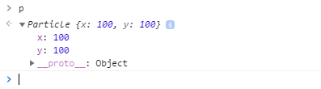
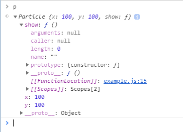
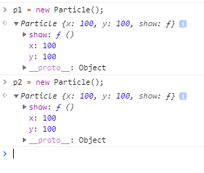
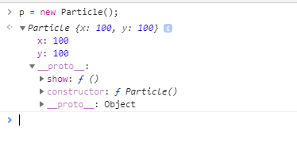

variable declaration:
    var, let, const
    if we try to reassign a const we'll get a TypeError

use backticks for template literals --> f strings in python

```
string = "hello"
print(f'{string}')

var string = "hello";
console.log(`${string}`);
```

JS's typeof is equivalent to type() in python

```
print(type(string))
console.log(typeof string);
```


## helper functions
the functions being called within another function are called
helper functions.


## function expression

A Function Expression defines a function as a part of a larger expression syntax (typically a variable assignment ). Functions defined via Functions Expressions can be named or anonymous. Function Expressions must not start with “function” (hence the parentheses around the self invoking example below)


## articles to read

--> hoisting in JavaScript
[Hoisting](http://www.adequatelygood.com/JavaScript-Scoping-and-Hoisting.html)

* JavaScript has function-level scope
* name resolution order
* function declaration takes priority over variable declaration


arrow function syntax

# Iterators

# Objects in JavaScript
There are seven fundamental datatypes in JS
objects,
1. string
2. number
3. boolean
4. null
5. undefined
6. symbol


When a non string is used as the property key, it will be converted to a string (via the toString() method, when available).

```
let obj = {};

//Number
obj[1] = "Number 1";
obj[1] === obj["1"]; //true

//Object
let number1 = {
  toString : function() { return "1"; }
}
obj[number1] === obj["1"]; //true
```

In an object, accessing an element that doesn't exist will not throw an error,
but returns undefined.

## prototypes in JavaScript
[prototypes-in-javascript](https://hackernoon.com/prototypes-in-javascript-5bba2990e04b)

```
function Particle() {
    this.x = 100;
    this.y = 100;
}

let p = new Particle();
```

here `Particle()` is called a constructor function,
`new` creates an object p using the constructor function.

now p is a Particle object
which has x and y as properties

if we print out p




but when it comes to a function like this,

```
function Particle() {
    this.x = 100;
    this.y = 100;

    this.show() {
        point(this.x, this.y);
    }
}
```

if we create two objects from this constructor function
`p1` and `p2`

```
p1 = new Particle();
p2 = new Particle();
```
The `Particle()` looks like this,



It is unnecessary for p1 and p2 to each have `show()` function
individually
because properties of an object should be unique, methods need not.



What we can do is put `show()` function somewhere and when `show()` is
required, we retrieve `show()` from there.


so instead we will not give `show()` in the `Particle()` directly, but

```
Particle.prototype.show = function() {
    point(this.x, this.y);
}
```

now if we see the `Particle()` object


thus, `Particle()` objects can access the prototype.show()


this results in `__proto__` chain


* if `p1.show()` the interpreter looks for `show()` in the methods
  if we can't see `show()` in the methods defined in the function
  then it will look in _proto_
  if it exists, it will execute

* we can override, functions in the _proto_ by defining function
  in the object itself,

  one usecase is to override the methods from the imported libraries


## Prototypical Inheritance in JavaScript
